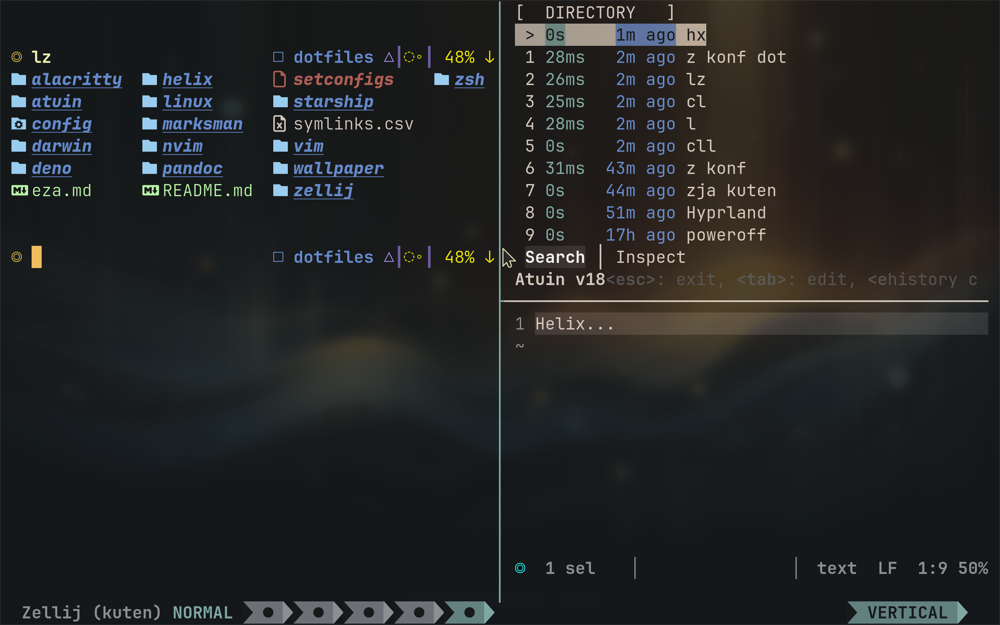

# Kuten (句点, くてん)



My dotfiles for Linux and Darwin systems. This repo is intended for my personal use along with [nizu](https://github.com/Indyandie/nizu) and [harroz](https://github.com/Indyandie/harroz).

## Programs

| program                  | Description                |
| ------------------------ | -------------------------- |
| [alacritty](./alacritty) | Terminal emulator          |
| [zsh](./zsh)             | Z-Shell config and aliases |
| [starship](./starship)   | Shell prompt               |
| [zellij](./zellij)       | Terminal multiplexer       |
| [helix](./helix)         | Post-modern text editor    |
| [vim](./vim)             | Ubiquitous text editor     |
| [nvim](./nvim)           | New Vim                    |
| [atuin](./atuin)         | Shell history              |
| [marksman](./marksman)   | Markdown LSP               |
| [deno](./deno)           | JavaScript runtime         |
| [pandoc](./pandoc)       | Document converter         |

## OS

Until I fully migrate to some version of Linux I'm stuck in a mac limbo. Fortunately they are both Unix based system. I vow to only ever use windows that are attached to buildings or vehicles.

| os                 | description |
| ------------------ | ----------- |
| [darwin](./darwin) | macOS       |
| [linux](./linux)   | Linux OS    |

## Install

The mapping for all soft links are found in [`symlinks.csv`](./symlinks.csv)

1. Run [`setconfigs`](./setconfigs)

```sh
./setconfigs
```
